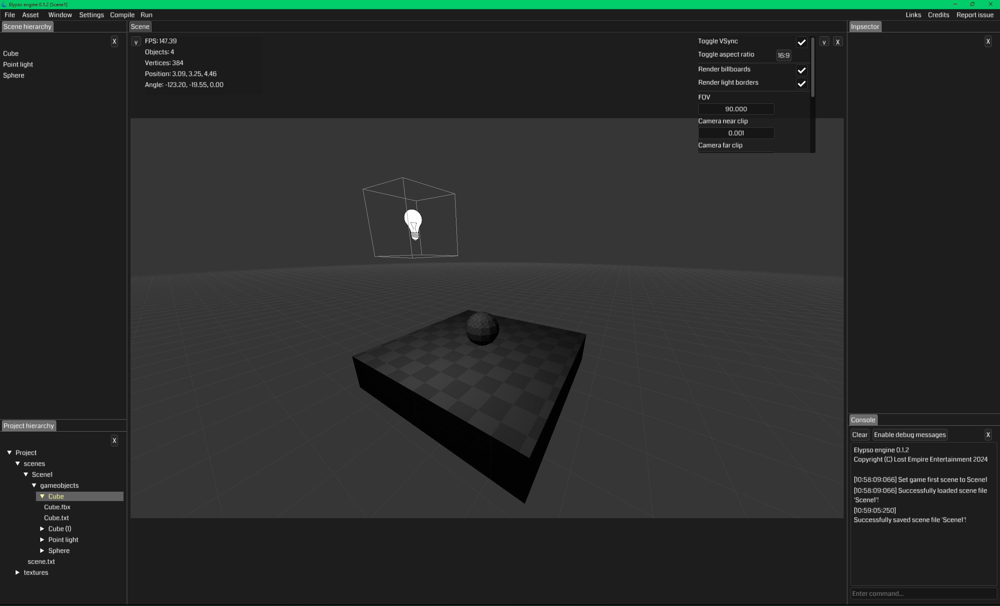

# Elypso engine

**Elypso engine** is an OpenGL C++ 20 game development engine. It runs natively on Windows and Linux (tested on Ubuntu-based distros and Arch) and it uses several libraries listed in [the library file](LIBRARIES.md).

**Elypso engine** is in early alpha development and will be heavily modified during alpha development. Beta is aimed for winter 2025, full release is aimed for winter 2026.

The documentation for **Elypso engine** will be found at the [website](https://elypsoengine.com)  in the near future so please look there for information, this README file will not cover how to install or use this program.

If you intend to download the source code and compile from source then please also download [Elypso hub](https://github.com/Lost-Empire-Entertainment/Elypso-hub)
 and [Elypso compiler](https://github.com/Lost-Empire-Entertainment/Elypso-compiler), they are not included in this repository. Once they are downloaded make sure they are all under the same parent folder or else they may not compile correctly.

The release version already has Hub, Engine and Game folders, you do not need to download Hub or Compiler, the Compiler is only used for compiling Hub, Engine and Engine library from source and the Release version already provides functional 0.1.2 and previous versions of the Hub, Engine and Game that are ready for use out of the box with all the required prerequisite information. 
 
---

### Prerequisites

Please read the Windows_prerequisites.txt or Linux_prerequisites.txt files to see what things you need to set up before you should run this program. More details will be provided on the website in the near future.

---

### False positives from Windows Security

If this is your first time running the program then Windows may throw false positives like trojan or other "security threats". Follow [this Microsoft tutorial](https://support.microsoft.com/en-us/windows/add-an-exclusion-to-windows-security-811816c0-4dfd-af4a-47e4-c301afe13b26) to exclude the repository folder from Windows Security scans.

---

### Links

[Support development on paypal](https://www.paypal.com/donate/?hosted_button_id=QWG8SAYX5TTP6)

[Official discord server](https://discord.gg/jkvasmTND5)

[Official youtube channel](https://youtube.com/greenlaser)

[Official website (documentation coming soon)](https://elypsoengine.com)

[Track development on the Trello board](https://trello.com/b/hbt6ebCZ/elypso-engine)

---

### Team

* [Greenlaser](https://github.com/greeenlaser) - *Lead developer*

* [tkpmonke](https://github.com/tkpmonke) - *Tester, Linux maintainer*

---

### Licenses

* [Elypso engine propietary license](LICENSE.md)
