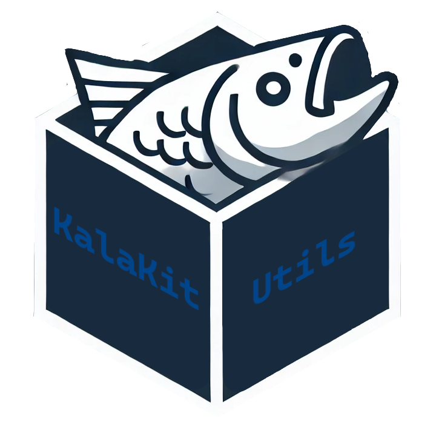

# KalaWindow

[](LICENSE.md)




KalaUtils is a lightweight C++ 20 library for Windows that is used as a wrapper for a bunch of string, file, git, window, input and os functions and variables. It can be easily reused across any projects and has no external dependecies.

# Prerequisites (when compiling from source code)

- Visual Studio 2022 (with C++ CMake tools and Windows 10 or 11 SDK)
- Ninja and CMake 3.30.3 or newer (or extract Windows_prerequsites.7z and run setup.bat)

To compile from source code simply run 'build_windows_release.bat' or 'build_windows_debug.bat' depending on your preferences then copy and attach the dll, lib and header files with your preferred way to your program source directory.

# WindowUtils

```cpp
#include "windowutils.hpp"
#include "osutils.hpp"
#include "enums.hpp"

using KalaKit::WindowUtils;
using KalaKit::DebugType;
using KalaKit::WindowState;

//get what the current debug type is
DebugType currentDebugType = WindowUtils::GetDebugType();

//set a new debug type whose message types will be printed
DebugType chosenDebugType = DebugType::DEBUG_KEY_HELD;
WindowUtils::SetDebugType(chosenDebugType);

//check what the current window focus required state is.
//if true, then window needs to be selected
//for any input to be detected and registred
bool currentWindowFocusRequiredState = WindowUtils::GetWindowFocusRequiredState;

bool chosenWindowFocusRequiredState = true;
WindowUtils::SetWindowFocusRequiredState(chosenWindowFocusRequiredState);

//assign a title to the window
string windowTitle = "yourWindowTitle";
void WindowUtils::SetWindowTitle(windowTitle);

//assign one of the many window states to the window
WindowState yourWindowState = WindowState::WINDOW_RESET;
WindowUtils::SetWindowState(yourWindowState);

//returns true if the window is borderless
bool isWindowBorderless = WindowUtils::IsWindowBorderless();

//set window borderless state to true or false with a bool parameter
bool yourBorderlessState = true;
WindowUtils::SetWindowBorderlessState(yourBorderlessState);

//returns true if the window is hidden
bool isWindowHidden = WindowUtils::IsWindowHidden();

//set window hidden state to true or false with a bool parameter
bool yourHiddenState = true;
WindowUtils::SetWindowHiddenState(yourHiddenState);

//returns the position of the window
POS windowPosition = WindowUtils::GetWindowPosition;

//set window position with width and height parameter
int yourWindowWidth = 1920;
int yourWindowHeight = 1080;
WindowUtils::SetWindowPosition(yourWindowWidth, yourWindowHeight);

//returns the full size of the window (with borders and top bar)
POS windowFullSize = WindowUtils::GetWindowFullSize;

//set window full size with width and height (with borders and top bar)
int yourfullWidth = 1111;
int yourFullHeight = 2222;
WindowUtils::SetWindowFullSize(yourfullWidth, yourFullHeight);

//returns the drawamble/client size of the window (without borders and top bar)
POS windowContentSize = WindowUtils::GetWindowContentSize;

//set window content size with width and height (without borders and top bar)
int yourContentWidth = 3333;
int yourContentHeight = 4444;
WindowUtils::SetWindowContentSize(yourContentWidth, yourContentHeight);

//get the maximum allowed size of the window
POS maxWindowSize = WindowUtils::GetWindowMaxSize();

//get the minimum allowed size of the window
POS minWindowSize = WindowUtils::GetWindowMinSize();

//set the new maximum and minimum allowed width and height
int newMaxWidth = 10000;
int newMaxHeight = 10000;
int newMinWidth = 1000;
int newMinHeight = 1000;
WindowUtils::SetMinMaxSize(
	newMaxWidth,
	newMaxHeight,
	newMinWidth,
	newMinHeight);
```
---

# InputUtils

```cpp
#include "inpututils.hpp"
#include "osutils.hpp"
#include "enums.hpp"

using KalaKit::InputUtils;
using KalaKit::Key;

//detect which key is currently held
bool isKeyDown = InputUtils::IsKeyHeld(yourKey);

//detect which key is currently held
bool isKeyPressed = InputUtils::IsKeyPressed(yourKey);

//detect if a combination of keys is pressed
//you must hold each key in order of the initializer list
//and once you press the last key the combo returns as true
static const std::initializer_list<Key> saveCombo
{
    Key::LeftControl,
    Key::S
};
bool isComboPressed = InputUtils::IsComboPressed(saveCombo);

//detect if either left or right mouse key was double-clicked.
//this does not need a reference to any Key
bool isDoubleClicked = InputUtils::IsMouseKeyDoubleClicked();

//detect if either left or right mouse key is held 
//and mouse is dragged in any direction.
//this does not need a reference to any Key
bool isMouseDragging = InputUtils::IsMouseDragging();

//get current mouse position relative to the client area (top-left = 0,0).
//coordinates are in pixels
POS mousePos = InputUtils::GetMousePosition();

//set a new position for the mouse
POS newMousePosition = { 0, 0 };
KalaInput::SetMousePosition(newMousePosition);

//get how much the cursor moved on screen (in client space) since the last frame.
//this uses absolute screen-based movement, affected by OS acceleration and DPI
POS mouseDelta = InputUtils::GetMouseDelta();

//set a new mouse delta for the mouse
POS newMouseDelta = { 100, 100 };
InputUtils::SetMouseDelta(newMouseDelta);

//get raw, unfiltered mouse movement from the hardware since the last frame.
//not affected by DPI, sensitivity, or OS mouse settings, ideal for game camera control
POS rawMouseDelta = InputUtils::GetRawMouseDelta();

//set a new raw mouse delta for the mouse
POS newRawMouseDelta = { 200, 200 };
InputUtils::SetRawMouseDelta(newRawMouseDelta);

//get how many scroll steps the mouse wheel moved since the last frame.
//positive = scroll up, negative = scroll down
int mouseWheelDelta = InputUtils::GetMouseWheelDelta();

//set a new mouse wheel delta for the mouse
int newMouseWheelDelta = 1234;
InputUtils::SetMouseWheelDelta(newMouseWheelDelta);

//returns true if cursor is not hidden
bool isMouseVisible = InputUtils::IsMouseVisible();

//allows to set the visibility state of the cursor,
//if true, then the cursor is visible
bool visibilityState = true;
InputUtils::SetMouseVisibility(visibilityState);

//returns true if cursor is locked
bool isMouseLocked = InputUtils::IsMouseLocked();

//allows to set the lock state of the cursor,
//if true, then the cursor is locked
bool lockState = true;
InputUtils::SetMouseLockState(lockState);

//call at the end of your update loop,
//this will reset pressed keys and mouse data.
//mouse delta, raw delta and wheel delta
//is reset only if mouse is not currently dragged
InputUtils::ResetFrameInput();
```
---

# StringUtils

Replace all occurences of {} with your own data.
vec3 is a struct of float x, float y and float z.
GLM is not used but is supported with this library vec3.

```cpp
#include <string>
#include <vector>
#include "stringutils.hpp"

using std::string;
using std::vector;
using KalaKit::StringUtils;

//replace a part of a string with another string
string original = "originalString";
string search = "original";
string replacement = "replacement";
string newString = StringUtils::StringReplace(original, search, replacement);

//replace a char of a string with a different char
string originalString = "yourTtring";
char searchChar = 'T';
char replacementChar = 'S';
string newCharString = StringUtils::CharReplace(originalString, searchChar, replacementChar);

//converts the contents of a vector to a vec3
//as long as the vector has 3 strings
//which can be converted to string or float.
//it is named kvec3 to be able to be reused along with glm::vec3
vector<string>& originalVector{};
kvec3 result = StringUtils::StringToVec3(originalVector);

//returns a vector of strings that are split by the chosen delimiter 
string inputString = "a,b,c,d";
char delimiter = ',';
vector<string> splitVector = StringUtils::Split(inputString, delimiter);

//removes all parts of the vector except those with the value of removeExceptInstance
string removeExceptInstance = "keepMe";
vector<string> removeExceptVector{};
vector<string> cleanedRemoveExceptVector(removeExceptVector, removeExceptInstance);

//remove all duplicates of each instance in the string vector
vector<string> duplicatesVector{};
StringUtils::RemoveDuplicates(duplicatesVector);

//returns true if string is a float
string floatString = "34.4";
bool isFloat = StringUtils::CanConvertStringToFloat(floatString);

//returns true if string is an int
string intString = "34";
bool isInt = StringUtils::CanConvertStringToInt(intString);

//returns true if char is allowed to be used in Windows path
char c = '-';
bool isValidChar = StringUtils::IsValidSymbolInPath(c);
```
---

# FileUtils

Replace all occurences of {} with your own data.

```cpp
#include <filesystem>
#include <string>
#include "fileutils.hpp"

using std::filesystem::path;
using std::string;
using KalaKit::FileUtils;

//returns the full output of the batch file as a string
const char* batOutputFile{};
string output = FileUtils::GetOutputFromBatFile(batOutputFile);

//returns the result of the bat file that was ran,
//runBatSeparate toggles whether the bat file should
//run independently or not from the main executable
string batRunFile{};
bool runBatSeparate = false;
int batRunResult = FileUtils::RunBatfile(batRunFile, runBatSeparate);

//run an executable from the given path with optional windows commands
string exePath{};
string runExeCommands = "";
FileUtils::RunApplication(exePath, runExeCommands);

//returns true if containsStringLine contains containsStringTarget inside a file
string containsStringLine{};
string containsStringTarget "targetString";
bool FileUtils::ContainsString(containsStringLine, containsStringTarget);

//move or rename file or folder from origin to target, 
//it always renames if the origin and target are in the same origin folder
string moveOrRenameOrigin{};
string moveOrRenameTarget{};
FileUtils::MoveOrRenameTarget(moveOrRenameOrigin, moveOrRenameTarget);

//copies file or folder from origin to target
string copyOrigin{};
string copyTarget{};
FileUtils::CopyTarget(copyOrigin, copyTarget);

//deletes file or folder at target path
string deleteTarget{};
FileUtils::DeleteTarget(deleteTarget);

//creates a new folder at the target destination
string newFolderTarget{};
FileUtils::CreateNewFolder(newFolderTarget);

//returns a string of the file name with an index after it,
//if no files or folders in current directory exist with same name
//then file name gets an index of (1), otherwise the index increases
//to the lowest next available number (n + 1)
string indexFilePath{};
string resultIndexPath(indexFilePath); 
```
---

# OSUtils

The point of this utils file is to provide common functions and variables 
that might otherwise not work on either Windows or Linux.

```cpp
#include "osutils.hpp"

using KalaKit::OSUtils;

//HWND on windows, struct of display and window in linux
WINDOW window;

//position, cursor location or offset. POINT on windows, x, y struct on linux
POS pos;

//size or bounds of a region on screen. RECT on windows, x, y, z, h on linux.
BOUNDS bounds;

```
---

# GitUtils

```cpp
#include "gitutils.hpp"

using KalaKit::GitUtils;

```
