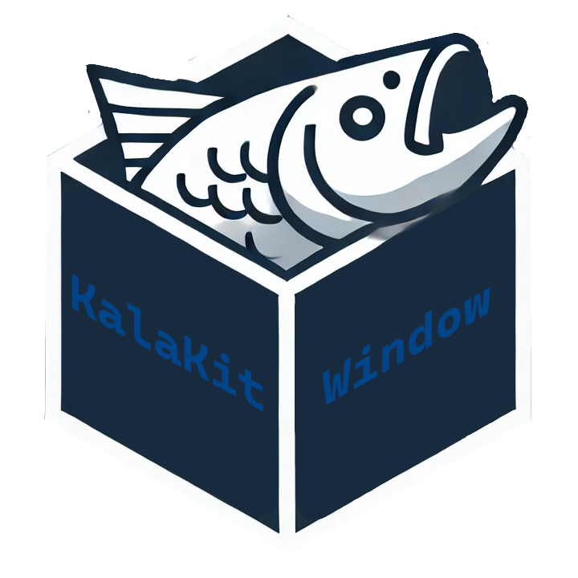

# KalaWindow

**KalaWindow** is a C++20 multimedia framework library for **Windows**\*¹, built for native desktop applications ranging from lightweight tools to full-featured game engines. 

**KalaWindow** provides **multi-window support**, **input handling** and a unified interface to the **native message loop** on each platform. The API is fully **OS-agnostic** and **vendor-neutral** - no platform-specific or graphics API headers\*² are included in its public interface, keeping user code clean and portable. KalaWindow includes a built-in rendering backend supporting **OpenGL 3.3**\*³. It features a simple **shader system** (compilation, binding, cleanup), along with utilities for **initialization** and **GPU resource management**. This gives you everything needed to plug rendering directly into your application's logic without boilerplate, whether you’re building a lightweight music player or a fully fledged game engine.

KalaWindow requires Windows 10 (1809 build 17763) or higher and is not supported on older versions.

> \*¹ KalaWindow plans to support Linux in a later version but no support for Mac, ARM, console, mobile or Web is planned.

> \*² Some KalaWindow headers pull in official GL extension headers: `opengl_functions_core.hpp` includes `glcorearb.h` and `glext.h`. `opengl_functions_win.hpp` includes `wgleht.hpp`. `opengl_functions_linux.hpp` includes `glxeht.hpp`

> \*³ KalaWindow plans to support Vulkan 1.3 in a later version but no support for DirectX or MoltenVK or other graphics backends is planned.

# Projects made with KalaWindow

Send me an email at `sanderveski@gmail.com` or message me on discord at `greenlaser` if you want your game or program you made with KalaWindow to be listed here

- [Circuit Chan](https://github.com/lost-empire-entertainment/circuit-chan)

# Links

[Donate on PayPal](https://www.paypal.com/donate/?hosted_button_id=QWG8SAYX5TTP6)

[Official Discord server](https://discord.gg/jkvasmTND5)

[Official Youtube channel](https://youtube.com/greenlaser)

[Official website (currently down for maintenance)](https://thekalakit.com)

[Track development on the Trello board](https://trello.com/b/rXmMDRaf/kalawindow)

# Docs

[How to build from source](docs/build_from_source.md)

[External libraries](docs/external_libraries.md)

[Minimum requirements](docs/minimum_requirements.md)

[KalaWindow Library Naming Scheme](docs/naming_scheme.md)